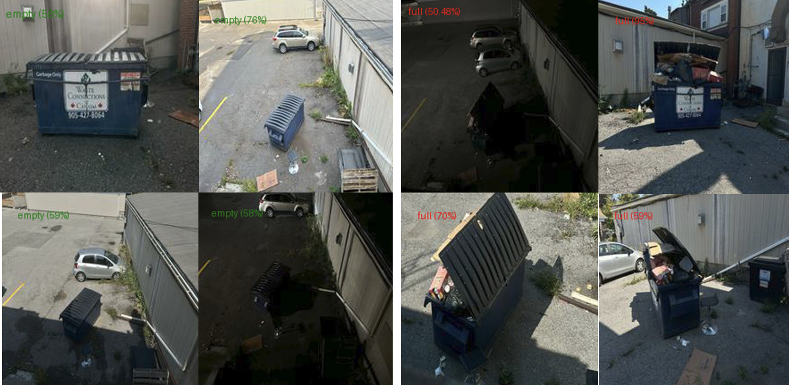
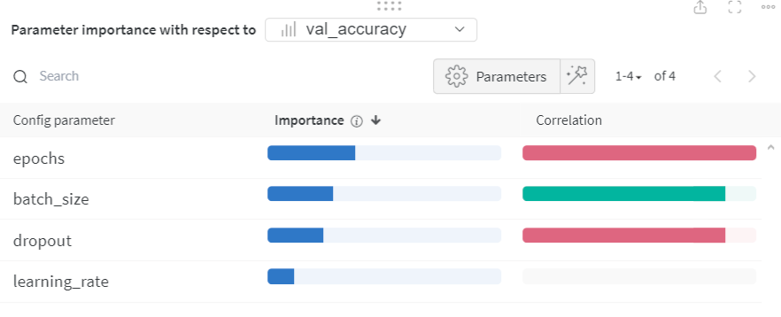
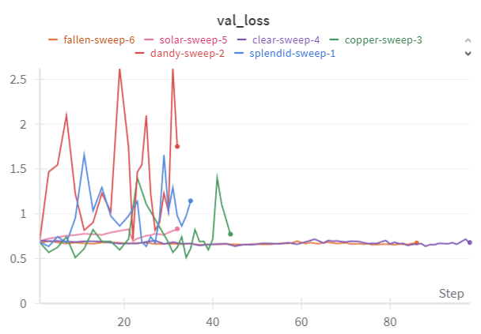
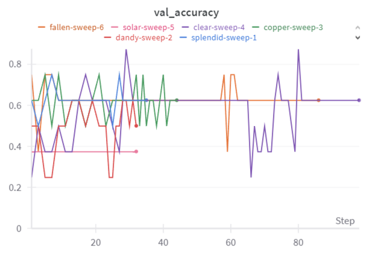
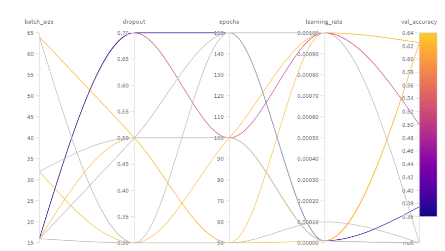
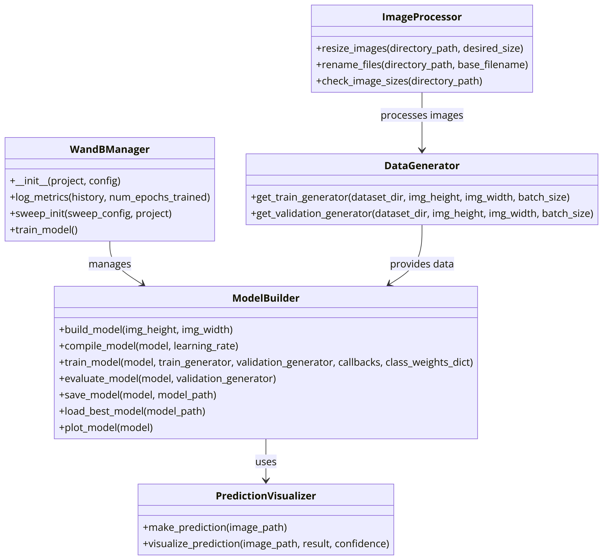

# Waste Bin Classification Project

This project, developed during my AI program at Centennial College, utilizes deep learning to classify waste bins as 'full' or 'empty'. It involved capturing images from various angles and times, preprocessing, model training with Convolutional Neural Networks (CNNs), and using Weights & Biases (WandB) for experiment tracking.



## Table of Contents
- [Introduction](#introduction)
- [Installation](#installation)
- [Usage](#usage)
- [Results](#results)
- [Future Work](#future-work)
- [Results by Weight and Bias](#results-by-weight-and-bias)
- [UML Diagram](#uml-diagram)
- [Industry Applications](#industry-applications)
- [License](#license)

## Introduction

Classifying waste bins as 'full' or 'empty' helps optimize waste collection processes and improve operational efficiency. This project leverages advanced techniques in computer vision and AI to address this issue.

## Installation

1. Clone the repository:
    ```bash
    git clone https://github.com/yourusername/waste_bin_classification.git
    ```
2. Navigate to the project directory:
    ```bash
    cd waste_bin_classification
    ```
3. Install the required packages:
    ```bash
    pip install -r requirements.txt
    ```

## Usage

### Preprocessing Images

Resize and rename images to ensure consistency:
```bash
python scripts/preprocess.py
```

### Training the Model

Train the CNN model with data augmentation and hyperparameter tuning:
```bash
python scripts/train.py
```

### Making Predictions

Make predictions on new images using the trained model:
```bash
python scripts/predict.py --image_path path_to_your_image.jpg
```

## Results

- **Validation Accuracy:** 62.5%
- **Validation Loss:** 0.61973

## Future Work

- Increase dataset size
- Experiment with more complex models
- Apply transfer learning from pre-trained models

## Results by Weight and Bias






## UML Diagram


## Industry Applications

Computer vision techniques, like the one implemented in this code, have various industry applications:

- **Waste Management**: Automated monitoring of waste bin status to optimize collection routes and schedules.
- **Retail**: Inventory management through real-time monitoring of stock levels on shelves.
- **Healthcare**: Monitoring patient activity and bed occupancy in hospitals.
- **Security**: Surveillance systems to detect unauthorized access or monitor crowd density.
- **Mining**: Detecting the fallout of Ground Engaging Tools (GET) in shovels to prevent plant shutdowns and damage to crushers.
- **Mining**: Monitoring ore grade by analyzing visual characteristics of the material on conveyor belts.
- **Mining**: Ensuring safety by detecting the presence of personnel or vehicles in hazardous areas.
- **Mining**: Inspecting haul roads for maintenance needs by identifying potholes and debris.

## License

This project is licensed under the Apache License 2.0. See the [LICENSE](LICENSE) file for details.

